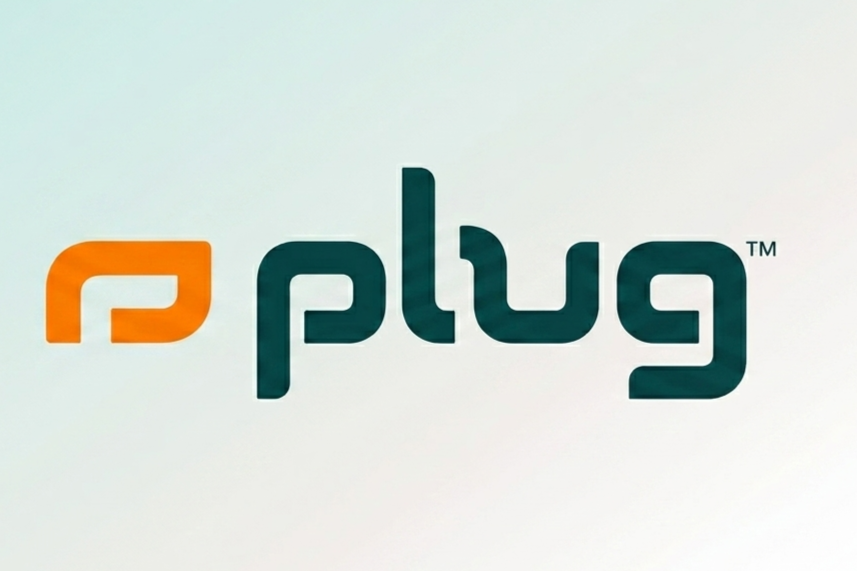
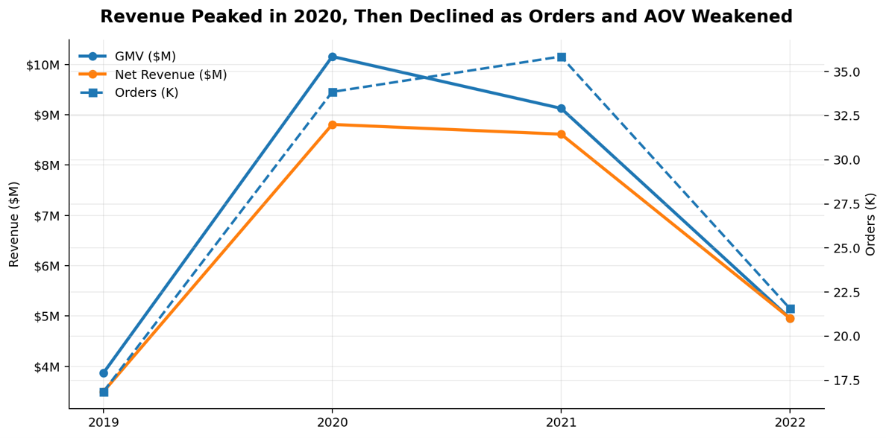
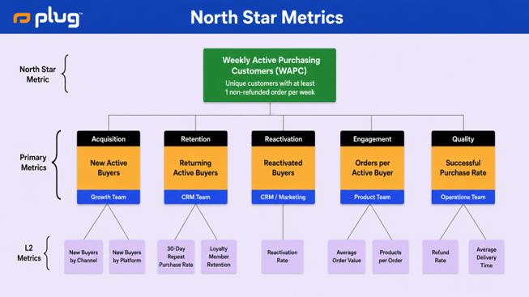
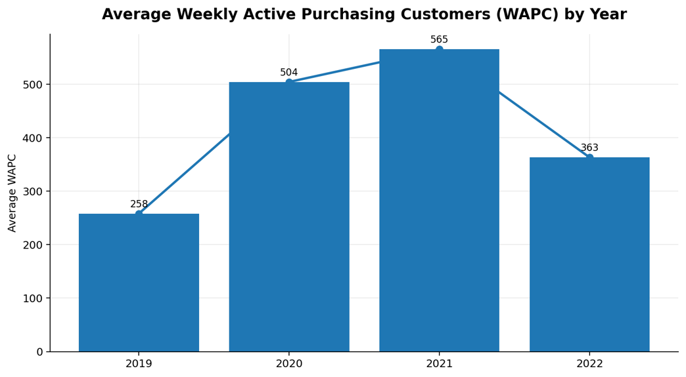
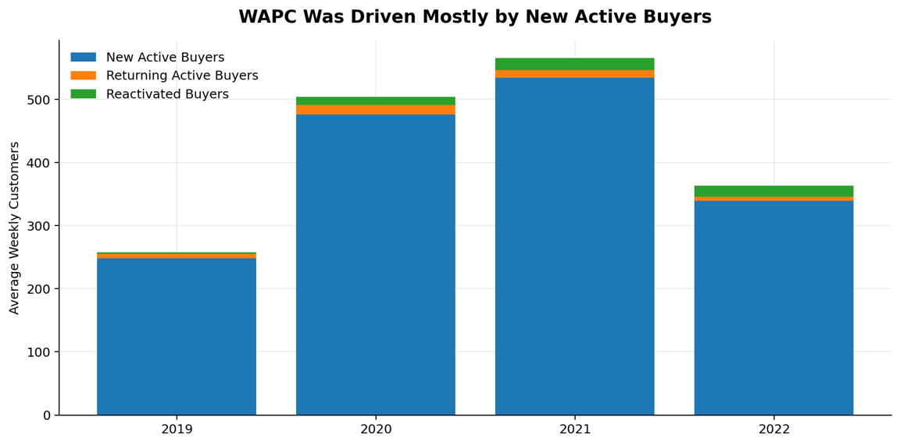
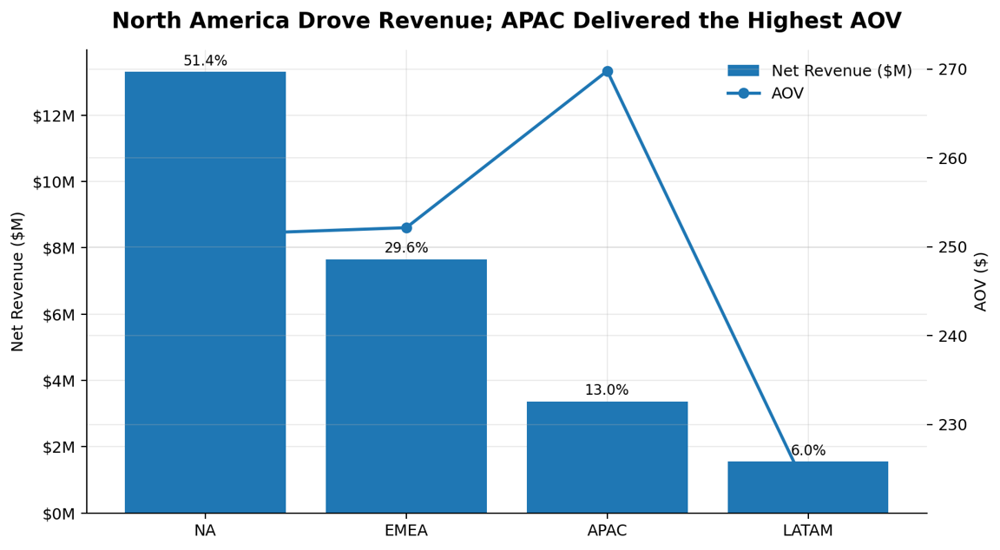
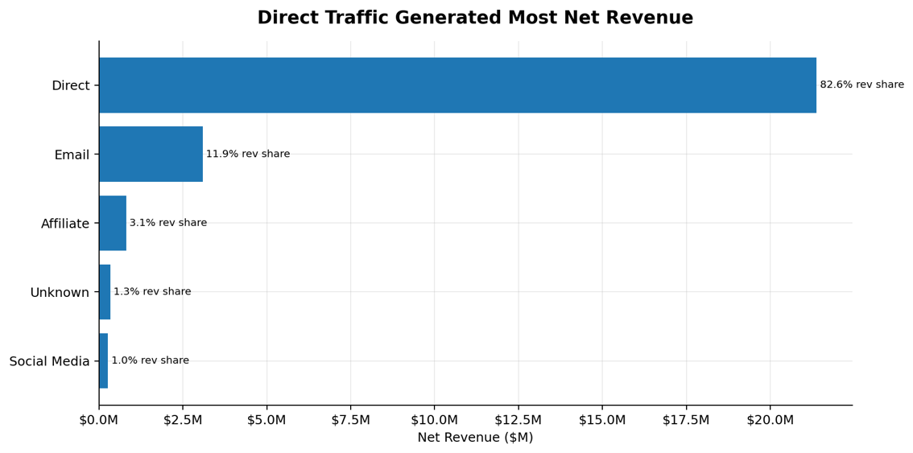
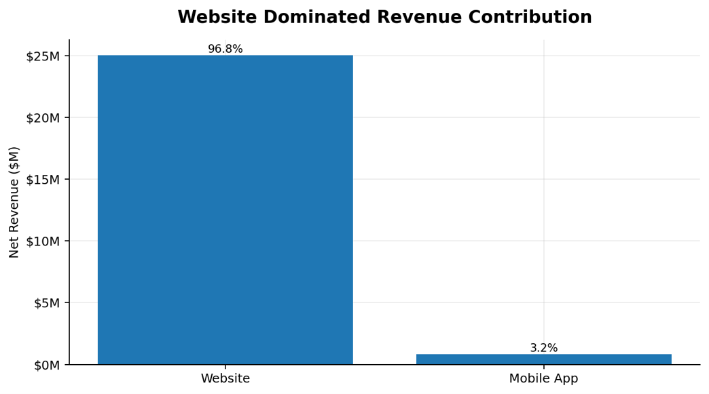
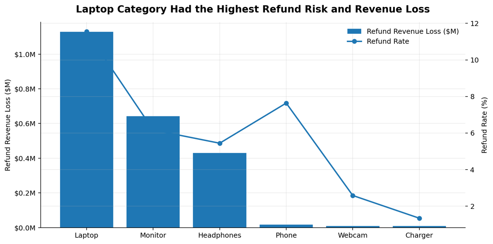

<h1 align="center">
  
  Plug Tech E-Commerce Performance Analysis
</h1>

## Core KPI Scorecard 
<table>
  <tr>
    <td align="center"><b>GMV</b>  <strong>$28.11M</strong></td>
    <td align="center"><b>Net Revenue</b>  <strong>$25.88M</strong></td>
    <td align="center"><b>Total Orders</b>  <strong>108,124</strong></td>
    <td align="center"><b>Active Buyers</b>  <strong>83,242</strong></td>
    <td align="center"><b>Avg WAPC</b>  <strong>423</strong></td>
    <td align="center"><b>Refund Rate</b>  <strong>4.97%</strong></td>
  </tr>
</table>

# Company Introduction

Plug Tech is a global e-commerce retailer specializing in consumer electronics. Through its online platform, the company sells products from major technology brands such as Apple, Samsung, and Lenovo, serving customers across North America, EMEA, APAC, and Latin America.

This report analyzes Plug Tech’s e-commerce performance from 2019 to 2022, focusing on revenue trends, order activity, average order value, customer lifecycle behavior, regional performance, channel effectiveness, fulfillment experience, refund behavior, and loyalty program signals. The goal is to identify key growth drivers, business risks, and opportunities to improve customer value and operational performance.

<strong>Business Context & Problem Statement</strong>

  
After strong growth in 2020, Plug Tech began to experience uneven business performance across years, regions, products, channels, and customer segments. Revenue declined after its 2020 peak, while changes in order volume, average order value, and weekly active purchasing customers suggest shifts in customer demand, product mix, and purchasing behavior

Leadership identified several concerns:

- Revenue fluctuations across years despite increasing transaction volume
- Heavy dependence on a small number of products and regions
- Uncertainty around whether the loyalty program was generating meaningful business value
- Potential operational inefficiencies affecting customer experience
  

<strong>Stakeholder Questions</strong>

  

1. How has Plug Tech’s business performance changed over time?
2. Is revenue decline driven by fewer active buyers, lower order value, weaker retention, or refund exposure?
3. Which regions, products, channels, and platforms contributed most to growth and risk?
4. How did refund behavior affect customer experience and revenue quality?
5. Did the loyalty program improve long-term customer value?
6. What metrics should Plug Tech track to monitor sustainable growth?

   

## 1. Executive Summary

From 2019 to 2022, Plug Tech generated $28.11M in GMV across 108,124 valid orders. After excluding refunded orders, the company generated $25.88M in net revenue, with 102,747 non-refunded orders and 83,242 active buyers.

•	Revenue peaked in 2020: GMV reached $10.16M, supported by a sharp increase in order volume and higher AOV. By 2022, GMV had declined to $4.96M, indicating that the business struggled to sustain peak demand.

•	North Star Metric performance weakened in 2022. Average WAPC increased from 258 in 2019 to 565 in 2021, then fell to 363 in 2022.

•	Customer activity was heavily acquisition-driven. New active buyers made up the majority of WAPC, while returning and reactivated buyers represented a relatively small share of weekly activity.

•	Retention was weak. Month 1 cohort retention was approximately 1.1%, and Month 3 retention declined below 0.5%, indicating limited short-term repeat purchasing after the first order.

•	Refunds represented 4.97% of orders but created $2.23M in revenue loss. Refund exposure was concentrated in premium electronics, especially laptops.

•	The loyalty program showed some positive recent value signals, but AOV alone is not enough to prove loyalty ROI. The business should also track retention, repeat purchase rate, orders per buyer, CLV, and CAC.

## 2. Core KPI Table

The KPI table below summarizes the core business metrics used throughout the report.

| KPI | Result |
|---|---:|
| GMV | $28.11M |
| Net Revenue | $25.88M |
| Total Orders | 108,124 |
| Non-Refunded Orders | 102,747 |
| Active Buyers | 83,242 |
| Average Order Value | $239.34 |
| AOV on Non-Refunded Orders | $251.86 |
| Net Revenue per Buyer | $310.88 |
| Refunded Orders | 5,377 |
| Refund Rate | 4.97% |
| Refund Revenue Loss | $2.23M |

*Data note: Three records with missing purchase timestamps were excluded from time-based analysis, leaving 108,124 valid orders for the 2019–2022 reporting period.*

## Yearly KPI Breakdown

| Year | GMV | Net Revenue | Orders | Active Buyers | AOV | Net Revenue / Buyer |
|---:|---:|---:|---:|---:|---:|---:|
| 2019 | $3.87M | $3.50M | 16,850 | 12,952 | $207.56 | $270.03 |
| 2020 | $10.16M | $8.81M | 33,851 | 25,212 | $260.21 | $349.37 |
| 2021 | $9.13M | $8.61M | 35,858 | 28,797 | $240.24 | $299.15 |
| 2022 | $4.96M | $4.96M | 21,565 | 18,528 | $229.89 | $267.57 |

## 3. North Star Metric Trend Analysis

Plug Tech’s proposed North Star Metric is Weekly Active Purchasing Customers (WAPC), defined as the number of unique customers who place at least one non-refunded order in a given week.
This metric tracks real customer purchasing activity and helps separate healthy customer growth from short-term revenue spikes driven by pricing, product mix, or one-time promotions.

| Metric | Value |
|---|---:|
| Average WAPC | 423 |
| Median WAPC | 485 |
| Peak WAPC | 658 |
| Lowest WAPC | 128 |

Average WAPC almost doubled from 258 in 2019 to 504 in 2020, then peaked at 565 in 2021. In 2022, WAPC declined to 363, indicating that the slowdown was not only a revenue issue but also a customer activity issue.

### WAPC Driver Breakdown

WAPC was decomposed into new active buyers, returning active buyers, and reactivated buyers. This helps identify whether active customer growth came from acquisition, retention, or win-back activity.

| Year | New Active Buyers | Returning Active Buyers | Reactivated Buyers |
|---:|---:|---:|---:|
| 2019 | 248 | 8 | 2 |
| 2020 | 476 | 16 | 13 |
| 2021 | 534 | 12 | 19 |
| 2022 | 339 | 7 | 17 |

Key insight: WAPC was driven mostly by new active buyers. This means Plug Tech’s growth was highly acquisition-driven. When new buyer acquisition weakened in 2022, overall WAPC declined significantly.

## 4. Customer Lifecycle Analysis
Customer lifecycle analysis segments buyers into new, retained, reactivated, and returning buyers. Non-refunded orders are used to focus on successful purchase behavior.

| Year | Active Buyers | New Buyers | Retained Buyers | Reactivated Buyers | Returning Buyers |
|---:|---:|---:|---:|---:|---:|
| 2019 | 1,115 | 1,079 | 13 | 10 | 13 |
| 2020 | 2,170 | 2,060 | 28 | 56 | 26 |
| 2021 | 2,449 | 2,324 | 20 | 83 | 22 |
| 2022 | 1,573 | 1,474 | 13 | 74 | 12 |

Plug Tech’s active buyer base was dominated by new buyers. Retained and reactivated buyers remained a much smaller portion of monthly activity, indicating that the business relied more on acquisition than repeat purchasing.

## Regional Performance Analysis

Regional analysis evaluates revenue contribution, AOV, order volume, refund risk, delivery time, and product preferences by geography.

North America generated over half of net revenue, while APAC had the highest AOV. This creates two strategic priorities: defend the North American revenue base and develop high-AOV opportunities in markets such as Japan.

## Channel & Platform Performance Analysis

Because the dataset does not include marketing spend, CAC, or ad cost, this analysis cannot calculate true CAC or ROAS. Channel quality is evaluated using new buyers, net revenue, AOV, repeat purchase rate, and refund rate.

| First Channel | New Buyers | Repeat Purchase Rate | 30-Day Repeat Rate | AOV | Refund Rate |
|---|---:|---:|---:|---:|---:|
| Direct | 64,081 | 6.2% | 1.4% | $268.23 | 5.0% |
| Email | 14,832 | 2.8% | 0.8% | $174.80 | 4.8% |
| Affiliate | 2,146 | 7.6% | 1.2% | $293.53 | 4.8% |
| Unknown | 1,190 | 2.5% | 0.6% | $235.57 | 2.5% |
| Social Media | 993 | 4.8% | 0.3% | $222.88 | 7.6% |

Direct traffic generated most net revenue and new buyers, creating channel concentration risk. Affiliate had the strongest customer-quality signal, with the highest repeat rate and AOV, but at smaller scale. Email had meaningful volume but weaker repeat behavior.

### Website vs Mobile App

| Platform | New Buyers | Net Revenue | Revenue Share | AOV | Repeat Rate | Refund Rate |
|---|---:|---:|---:|---:|---:|---:|
| Website | 67,702 | $25.05M | 96.8% | $296.01 | 6.5% | 5.6% |
| Mobile App | 15,540 | $832K | 3.2% | $45.88 | 1.5% | 2.1% |

The website dominated business performance, generating almost all net revenue and attracting higher-value customers. The mobile app had lower AOV and repeat behavior, likely due to its lower-priced product mix.

## Refund & Revenue Quality Analysis

Laptop products had the highest refund risk and generated about half of total refund revenue loss. This suggests product expectations, product quality, fulfillment experience, or post-purchase support should be reviewed for premium laptop products.

## 3. Recommendations

| Owner | Recommendation | Rationale | KPI to Track |
|---|---|---|---|
| Marketing | Launch seasonal campaigns earlier for Q4 and back-to-school periods. | September, November, and December showed strong revenue, order volume, and AOV. | WAPC, Net Revenue, AOV, Orders |
| Marketing | Test targeted campaigns for high-AOV premium products. | Products such as Apple iPhone had high AOV but low revenue contribution. | AOV, Net Revenue, Refund Rate |
| Marketing | Expand localized campaigns in Japan. | Japan had the highest AOV among major countries and lower refund risk. | Orders, Net Revenue, AOV, WAPC |
| CRM / Loyalty | Shift from acquisition-only growth to lifecycle marketing. | WAPC and cohort retention show weak repeat-purchase behavior. | Repeat Purchase Rate, Month 1 Retention, WAPC |
| CRM / Loyalty | Evaluate loyalty program ROI more rigorously. | AOV signals alone do not prove long-term loyalty value. | CLV, Orders per Buyer, Retention, CAC |
| Product | Investigate high-refund laptop products. | Laptop category had the highest refund rate and refund revenue loss. | Refund Rate, Refund Loss, Product NPS |
| Product | Prioritize high-performing products with manageable refund risk. | Revenue and refund analysis can identify profitable product focus areas. | Net Revenue, Refund Rate, Margin |
| Strategy | Reduce geographic and channel concentration risk. | North America and direct traffic account for a large share of revenue. | Revenue Share, WAPC by Region, WAPC by Channel |
| Operations | Maintain a reliable 7-day delivery experience and monitor delayed orders. | Delivery time was stable but orders beyond 8–10 days should be monitored. | Median Delivery Time, Delay Rate, Refund Rate |

The highest priority is to improve customer retention and repeat purchase behavior. Revenue recovery should not depend only on new customer acquisition; it should be supported by stronger lifecycle marketing, loyalty performance measurement, premium-product optimization, and refund reduction.

## Appendix

Data Scope:

Plug Tech's database structure consists of four tables: orders, customers, geo_lookup and order_status, including near 88,000 customers and over 108,000 transactions.
- Check out the full Excel [spreadsheet](Excel/cleaned_data.xlsx)
- Check out Data Structure & [ERD](pic/ERD.png)
- For more details about the dataset description and cleaning process check out the [Dataset Summary & Issue Log](Excel/PlugTech_Dataset_Report.pdf)
- See more of my [exploration](SQL/PlugTech_Exploration.sql) and [analysis](SQL/PlugTech_Analysis.sql) in SQL.

Key Definitions：

| Metric | Definition |
|---|---|
| WAPC | Unique customers with at least one non-refunded order in a given week |
| GMV | SUM(USD_PRICE) across all valid orders |
| Net Revenue | SUM(USD_PRICE_MOD) for non-refunded orders |
| AOV | Net Revenue divided by total orders |
| Active Buyers | Unique USER_ID values with at least one non-refunded order |
| New Buyers | Customers whose first non-refunded purchase occurred in the period |
| Retained Buyers | Customers who purchased in the prior period and purchased again in the current period |
| Reactivated Buyers | Customers who had purchased before, became inactive for more than 90 days, then purchased again |
| Repeat Purchase Rate | Share of buyers who made another purchase on a later date |
| Refund Rate | Refunded orders divided by total orders |
| Refund Revenue Loss | SUM(USD_PRICE_MOD) for refunded orders |
| Purchase-to-Delivery Time | DELIVERY_TS minus PURCHASE_TS |

Limitation：

•	The dataset does not include marketing spend, so CAC and ROAS cannot be calculated.

•	AOV and order behavior alone cannot prove loyalty program ROI; retention, CLV, and acquisition cost metrics are needed.

•	Refund timing fields appear unusual in some cases, so refund date lag should be validated before using it for return-window analysis.

•	Correlation does not imply causation. Changes in revenue, retention, or refund behavior may require controlled tests or additional operational data.

