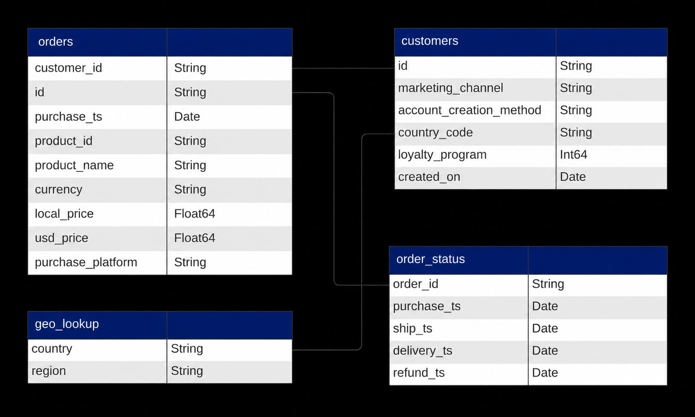

# Plug Tech E-Commerce Performance Analysis

## Company Overview

  

**Plug Tech**, founded in 2018, is a global e-commerce retailer specializing in consumer electronics products. The company sells popular brands such as Apple, Samsung, and Lenovo through its online platform and serves customers across multiple regions including North America, Europe, Middle East & Africa, Asia-Pacific, and Latin America. 

Between **2019 and 2022**, Plug Tech experienced rapid growth in order volume and product demand, supported by multiple marketing channels such as direct traffic, email marketing, social media, and affiliate partnerships. To strengthen customer retention and encourage repeat purchases, the company also introduced a **loyalty program** in 2019.

As the business expands, management aims to better understand sales performance, customer behavior, and operational challenges across products and regions.

<strong>Business Context & Problem Statement</strong>

  
Despite strong growth, Plug Tech began to observe uneven business performance across markets and customer segments.

While order volume remained high, leadership identified several concerns:

- Revenue fluctuations across years despite increasing transaction volume
- Heavy dependence on a small number of products and regions
- Unclear effectiveness of marketing channels in attracting high-value customers
- Uncertainty around whether the loyalty program was generating meaningful business value
- Potential operational inefficiencies affecting customer experience

<strong>Stakeholder Questions</strong>

  

1. How is the business performing over time?
2. Which regions and products contributed most to growth and risk?
3. How did refund behavior impact customer experience and revenue quality?
4. Did the loyalty program improve long-term customer value?

<strong>Data Structure & ERD</strong>

  
Plug Tech's database structure consists of four tables: orders, customers, geo_lookup and order_status, including near 88,000 customers and over 108,000 transactions.
  

<b>Table of Contents</b>

- [1. Executive Summary](#1-executive-summary)

- [2. Key Insights](#2-key-insights)
  - [Time-Based Sales Trends](#time-based-sales-trends)
    - [A. Yearly Trend](#a-yearly-trend)
    - [B. Monthly Trend](#b-monthly-trend)
    - [C. Seasonal Trend](#c-seasonal-trend)
  - [Regional Performance](#regional-performance)
  - [Refund & Customer Experience Analysis](#refund--customer-experience-analysis)
  - [Loyalty Program](#loyalty-program)

- [3. Recommendations](#3-recommendations)
  - [For Marketing Team](#for-marketing-team)
  - [For Product Team](#for-product-team)

## 1. Executive Summary

## 2. Key Insights

### Time-Based Sales Trends

#### A. Yearly Trend

- The company experienced strong growth in 2020, where revenue increased significantly from $3.9M to $10.2M, supported by both higher order volume and AOV. This suggests that the business was not only acquiring more customers, but also generating higher-value transactions, likely driven by stronger demand or a favorable product mix.

- Despite order count continued growing in 2021 (+6%), **total revenue declined by 10%** as AOV fell from $300 to $255. This indicates that business growth became increasingly volume-driven rather than value-driven. Customers were still purchasing, but they were spending less per order, which may suggest a shift toward lower-priced products, reduced premium sales, or changing customer purchasing behavior.

- By 2022, **revenue dropped by 46%, orders declined by 40%**, and AOV returned to $230, matching 2019 levels. This suggests weakening demand and reduced transaction quality. This may indicate a broader contraction in business performance that warrants further investigation into customer retention, product mix, or market conditions.

#### B. Monthly Trend

- **December** consistently generating the highest revenue ($2.85M) and highest order volume (10,791 orders). This strongly suggests a holiday-driven demand cycle. 

- **September–October** showed strong transaction quality, even if not always the highest volume months. AOV peaked in October ($272) and remained strong throughout the fall season. This indicates that customers may purchase higher-value products during this period, possibly premium electronics or larger-ticket items. For the business, fall appears to be a high-value sales window, not just a high-volume one.

- **February** was the weakest-performing month, with the lowest revenue ($1.91M) and significant declines in both revenue (-25%) and orders (-27%). This suggests a post-holiday demand drop, which is common in e-commerce after peak seasonal spending. 

- **October** showed an unusual contradiction: it recorded the highest AOV, but one of the lowest order counts (7,212) and the sharpest monthly declines in revenue (-28%) and orders (-29%). This indicates fewer but higher-value purchases, suggesting revenue was supported by premium transactions rather than broad customer demand.

#### C. Seasonal Trend

- Seasonality had a moderate impact on sales performance, while refund behavior and regional demand remained relatively stable.

- **Winter** was still the strongest-performing season, generating the highest revenue ($7.32M) and order volume (28,039), suggesting increased customer demand during year-end periods, likely influenced by holiday shopping and promotions.

- **Autumn** generated the highest AOV at $266.38 despite having the lowest order count, indicating stronger revenue efficiency and a higher-value product mix during this period.

### Regional Performance

- **North America** contributed 52% of total revenue, making it Plug Tech’s largest market but also creating geographic concentration risk.

- **Latin America** was the weakest region, contributing only 6% of revenue and the lowest AOV, indicating lower market penetration and growth maturity.

- **Japan** recorded the highest AOV ($393) despite lower order volume, suggesting strong premium-product opportunities.

Regional performance was primarily driven by order volume rather than customer spending behavior. This suggests that improving customer acquisition and market penetration in lower-volume regions such as LATAM and APAC may support more balanced long-term growth.

### Refund & Customer Experience Analysis

- Plug Tech recorded a **5% refund rate** (5,377 refunded orders), below common consumer electronics benchmarks **(8–15%)**, indicating relatively healthy return performance.

- Refund exposure was concentrated in premium electronics, with Apple contributing 58% of refunds and ThinkPad/MacBook carrying the highest product-level return risk.

- Refund rates remained relatively stable across geographic regions, indicating that regional performance was not a major driver of refund behavior.

### Loyalty Program

- Loyalty AOV increased gradually over time, while Non-Loyalty AOV declined after 2020, suggesting stronger long-term customer value among enrolled members.
- By mid-2021, Loyalty customers began outperforming Non-Loyalty customers in AOV, indicating improved spending consistency and stronger retention potential.
- Although trends appear positive, loyalty ROI cannot be fully confirmed without retention, CAC, or repeat-purchase metrics.

## 3. Recommendations

### For Marketing Team

- **Launch Q4 and Back-to-School Campaigns Earlier**: November, December, and September consistently showed strong revenue, order volume, and AOV performance. Starting promotions earlier could help capture demand sooner and extend peak sales momentum.

- **Boost Promotion for High-AOV Underperformers (e.g., Apple iPhone)**: Despite a **high AOV of $741**, the Apple iPhone made up just **0.8% of total revenue**. With tailored email campaigns or time-sensitive bundles, this product could generate stronger ROI and leverage its premium pricing.

- **Capitalize on Japan's High AOV ($393)**: Japan has the **highest AOV** among the top 5 revenue-generating countries, yet contributes just **2% of orders**. Regionalized campaigns and localized messaging could convert this high-margin market into a more consistent revenue driver.

- **Improve Loyalty Program Engagement**: Loyalty AOV improved gradually, suggesting better long-term customer value. However, loyalty performance weakened in late 2022. Marketing can improve engagement through promoting exclusive perks, early access to bestsellers, and personalized discounts may boost adoption and re-engage loyalty customers.

### For Product Team

- **Investigate High-Refund Products (MacBook Air and ThinkPad)**: The MacBook Air had a refund rate of 11.4%, resulting in $719K in lost revenue. High return rates may indicate product misalignment or fulfillment issues that warrant investigation and intervention.
- **Prioritize High-ROI Products**: Prioritize Gaming Monitors and Apple AirPods, which generated strong revenue with manageable refund risk. Increasing inventory support, bundling strategies, and promotional focus may maximize profitable growth.
- **Reassess Low-Performing SKUs**: Low-performing products such as Bose SoundSport should be reassessed, as they contributed minimal revenue compared with other products. Reducing inventory or repositioning weaker SKUs could improve overall product mix efficiency.
  

### For Leadership / Strategy Team

- **Pursue High-AOV Opportunity in Japan ($393 AOV)**: Japan contributed a smaller share of total revenue, it recorded the highest Average Order Value (AOV) at $393, suggesting stronger willingness to spend on premium products. Exploring localized campaigns, region-specific offers, and premium product positioning in high-value markets like Japan to strengthen higher-margin revenue opportunities. 

- **Evaluate Loyalty Program ROI**: The loyalty program also showed positive long-term signals, as loyalty customers demonstrated stronger AOV stability than non-loyalty customers over time. However, since the dataset does not fully confirm overall program ROI, leadership should continue monitoring retention rate, repeat purchase behavior, customer lifetime value (CLV), and acquisition efficiency to determine whether the program should be maintained, optimized, or scaled further.

- **Diversify Market Exposure Beyond North America**: North America contributing 52% of total revenue, but this heavy dependence also creates geographic concentration risk. To support more balanced long-term growth, leadership should expand growth efforts into underpenetrated markets such as APAC and LATAM, where increased market penetration could reduce overreliance on a single region and improve business resilience.

